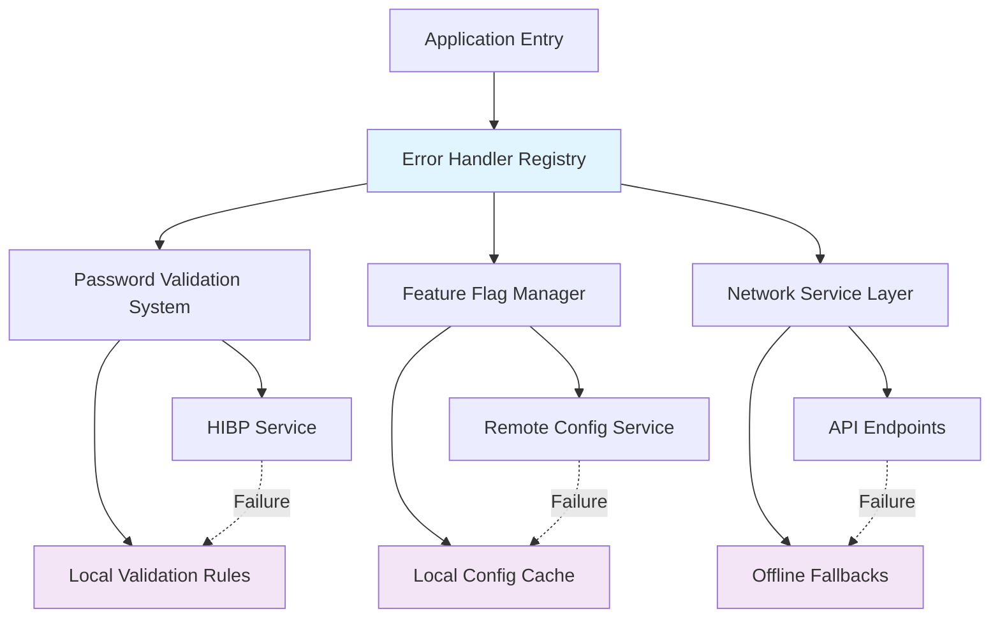
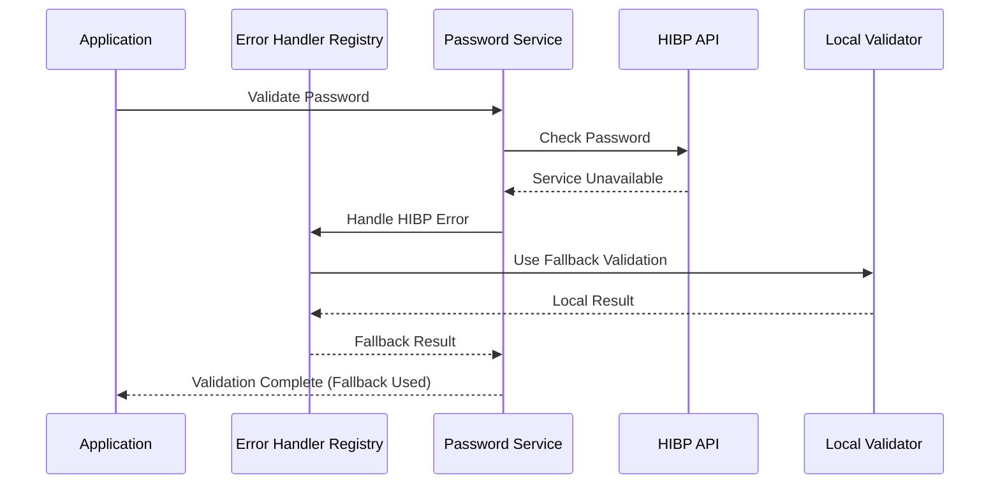

# Error Handling Architecture Design

## Overview

This design addresses the critical bundling failures and implements a robust error handling architecture for the React Native/Expo application. The solution focuses on eliminating dynamic import issues that cause Metro bundler failures while maintaining comprehensive error handling capabilities for password validation, feature flags, and system resilience.

## Architecture

### Core Principles

1. **Static Import Strategy**: Replace all dynamic imports with static imports to ensure Metro bundler compatibility
2. **Centralized Error Management**: Maintain a single source of truth for error handling across the application
3. **Graceful Degradation**: Ensure core functionality remains available when external services fail
4. **Performance Optimization**: Minimize bundle size impact while maintaining comprehensive error handling

### System Architecture Diagram



## Components and Interfaces

### 1. Error Handler Registry

**Purpose**: Centralized error handling system with static imports

**Key Features**:
- Static import structure for Metro bundler compatibility
- Categorized error handlers for different system components
- Performance monitoring and logging capabilities
- Retry logic with exponential backoff

**Interface**:
```typescript
interface ErrorHandlerRegistry {
  registerHandler(category: ErrorCategory, handler: ErrorHandler): void;
  handleError(error: Error, context: string): ErrorResult;
  getHandler(category: ErrorCategory): ErrorHandler;
  clearHandlers(): void;
}
```

### 2. Enhanced Password Validation System

**Purpose**: Robust password validation with HIBP integration and fallback mechanisms

**Key Features**:
- Static error handler imports
- Graceful HIBP service degradation
- Local validation rule enforcement
- Real-time validation feedback

**Interface**:
```typescript
interface PasswordValidationSystem {
  validatePassword(password: string, context: ValidationContext): ValidationResult;
  checkHIBP(password: string): Promise<HIBPResult>;
  getFallbackValidation(password: string): LocalValidationResult;
  resetValidationState(): void;
}
```

### 3. Feature Flag Manager

**Purpose**: Reliable feature flag management with offline capabilities

**Key Features**:
- Default flag value system
- Local cache with TTL
- Graceful service failure handling
- Real-time flag updates when service recovers

**Interface**:
```typescript
interface FeatureFlagManager {
  getFlag(flagName: string): Promise<boolean>;
  getAllFlags(): Promise<FeatureFlags>;
  setDefaultFlags(defaults: FeatureFlags): void;
  refreshFlags(): Promise<void>;
}
```

### 4. Network Service Layer

**Purpose**: Resilient network operations with comprehensive error handling

**Key Features**:
- Automatic retry with exponential backoff
- Request timeout management
- Offline detection and fallback
- Request deduplication

**Interface**:
```typescript
interface NetworkService {
  request<T>(config: RequestConfig): Promise<T>;
  setRetryPolicy(policy: RetryPolicy): void;
  enableOfflineMode(): void;
  getConnectionStatus(): ConnectionStatus;
}
```

## Data Models

### Error Context Model
```typescript
interface ErrorContext {
  component: string;
  action: string;
  userId?: string;
  sessionId: string;
  timestamp: Date;
  metadata?: Record<string, any>;
}
```

### Validation Result Model
```typescript
interface ValidationResult {
  isValid: boolean;
  requirements: RequirementStatus[];
  errors: ValidationError[];
  warnings: ValidationWarning[];
  hibpStatus: HIBPStatus;
  fallbackUsed: boolean;
}
```

### Feature Flag Model
```typescript
interface FeatureFlag {
  name: string;
  enabled: boolean;
  defaultValue: boolean;
  lastUpdated: Date;
  source: 'remote' | 'cache' | 'default';
}
```

## Error Handling

### Error Categories and Handling Strategies

1. **Bundle Resolution Errors**
   - **Strategy**: Replace dynamic imports with static imports
   - **Fallback**: Pre-loaded error handlers in application bundle
   - **Recovery**: Immediate (no runtime recovery needed)

2. **Network Connectivity Errors**
   - **Strategy**: Exponential backoff retry with circuit breaker
   - **Fallback**: Cached responses and offline mode
   - **Recovery**: Automatic retry when connectivity restored

3. **Service Unavailability Errors**
   - **Strategy**: Graceful degradation with local alternatives
   - **Fallback**: Default configurations and local validation
   - **Recovery**: Background service health checks

4. **Validation Errors**
   - **Strategy**: Multi-layer validation with progressive enhancement
   - **Fallback**: Local validation rules when external services fail
   - **Recovery**: Retry external validation when services recover

### Error Handling Flow



## Testing Strategy

### Unit Testing
- **Error Handler Registry**: Test all error categories and fallback mechanisms
- **Password Validation**: Test HIBP integration and local fallbacks
- **Feature Flag Manager**: Test cache behavior and default value handling
- **Network Service**: Test retry logic and timeout handling

### Integration Testing
- **End-to-End Validation Flow**: Test complete password validation with service failures
- **Feature Flag Integration**: Test flag retrieval with various service states
- **Bundle Compatibility**: Test Metro bundler with static import structure
- **Error Recovery**: Test automatic recovery when services come back online

### Performance Testing
- **Bundle Size Impact**: Measure bundle size increase from static imports
- **Error Handling Overhead**: Measure performance impact of error handling
- **Memory Usage**: Monitor memory consumption of error logging and caching
- **Network Efficiency**: Test retry logic efficiency and request deduplication

### Error Simulation Testing
- **Network Failures**: Simulate various network error conditions
- **Service Outages**: Test behavior during complete service unavailability
- **Partial Failures**: Test mixed success/failure scenarios
- **Recovery Scenarios**: Test automatic recovery when services restore

## Implementation Phases

### Phase 1: Bundle Resolution Fix
1. Replace dynamic imports with static imports in password validation
2. Update Metro bundler configuration for better error handling
3. Implement static error handler registry
4. Test bundle generation and deployment

### Phase 2: Enhanced Error Handling
1. Implement centralized error handler registry
2. Add comprehensive logging and monitoring
3. Implement retry logic with exponential backoff
4. Add performance monitoring for error handling

### Phase 3: Service Resilience
1. Implement feature flag manager with caching
2. Add network service layer with offline support
3. Implement graceful degradation for all external services
4. Add automatic recovery mechanisms

### Phase 4: Monitoring and Optimization
1. Add error analytics and reporting
2. Implement performance monitoring
3. Optimize bundle size and runtime performance
4. Add comprehensive documentation and debugging tools

## Security Considerations

### Error Information Exposure
- Sanitize error messages before logging or displaying to users
- Avoid exposing internal system details in user-facing error messages
- Implement secure error logging that doesn't leak sensitive information

### Fallback Security
- Ensure fallback validation maintains security standards
- Implement rate limiting for retry mechanisms
- Validate all cached data before use

### Network Security
- Implement proper SSL/TLS validation for all network requests
- Add request signing for sensitive operations
- Implement proper timeout and abort mechanisms to prevent resource exhaustion

## Performance Optimizations

### Bundle Size Management
- Use tree shaking to eliminate unused error handling code
- Implement lazy loading for non-critical error handlers
- Optimize error message storage and retrieval

### Runtime Performance
- Implement efficient error categorization algorithms
- Use object pooling for frequently created error objects
- Optimize logging performance with batching and async operations

### Memory Management
- Implement proper cleanup for error logs and retry state
- Use weak references where appropriate to prevent memory leaks
- Implement configurable log retention policies