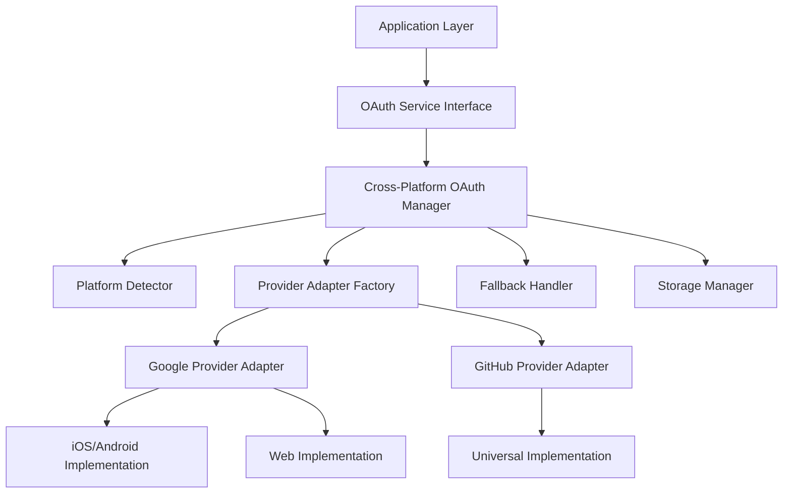

# OAuth Cross-Platform Compatibility Design

## Overview

This design implements a robust OAuth authentication system that works consistently across iOS, Android, and Web platforms. The solution addresses the current issue where `GoogleSignin.isSignedIn()` fails on web platforms by implementing platform detection, adapter patterns, and graceful fallbacks.

The architecture uses a layered approach with platform detection, provider-specific adapters, and a unified service interface that abstracts platform differences from the application layer.

## Architecture

### High-Level Architecture



### Component Responsibilities

- **OAuth Service Interface**: Maintains the existing API contract while delegating to platform-aware implementations
- **Cross-Platform OAuth Manager**: Orchestrates OAuth operations using appropriate platform adapters
- **Platform Detector**: Identifies current runtime platform and available OAuth capabilities
- **Provider Adapter Factory**: Creates platform-specific provider implementations
- **Provider Adapters**: Handle platform-specific OAuth operations for each provider
- **Fallback Handler**: Provides graceful degradation when platform-specific methods fail
- **Storage Manager**: Handles cross-platform OAuth data persistence

## Components and Interfaces

### Platform Detector

```javascript
class PlatformDetector {
  static detectPlatform() {
    // Returns: 'ios', 'android', 'web'
  }
  
  static getOAuthCapabilities(platform) {
    // Returns available OAuth methods for platform
  }
  
  static isNativeOAuthAvailable(provider, platform) {
    // Checks if native OAuth library is available
  }
}
```

### Provider Adapter Interface

```javascript
class ProviderAdapter {
  async signIn(config) {
    // Platform-specific sign-in implementation
  }
  
  async signOut() {
    // Platform-specific sign-out implementation
  }
  
  async isSignedIn() {
    // Platform-specific sign-in status check
  }
  
  async getTokens() {
    // Platform-specific token retrieval
  }
  
  async revokeTokens() {
    // Platform-specific token revocation
  }
}
```

### Google Provider Adapter Implementations

#### Native Implementation (iOS/Android)
```javascript
class GoogleNativeAdapter extends ProviderAdapter {
  async signOut() {
    const isSignedIn = await GoogleSignin.isSignedIn();
    if (isSignedIn) {
      await GoogleSignin.signOut();
    }
    return { success: true };
  }
  
  async isSignedIn() {
    return await GoogleSignin.isSignedIn();
  }
}
```

#### Web Implementation
```javascript
class GoogleWebAdapter extends ProviderAdapter {
  async signOut() {
    // Use web-compatible methods
    // Check localStorage/sessionStorage for tokens
    // Use Google's web sign-out if available
    // Always clear local storage
    return { success: true };
  }
  
  async isSignedIn() {
    // Check web storage for valid tokens
    // Validate token expiration
    return this.hasValidTokens();
  }
}
```

### Cross-Platform OAuth Manager

```javascript
class CrossPlatformOAuthManager {
  constructor() {
    this.platform = PlatformDetector.detectPlatform();
    this.capabilities = PlatformDetector.getOAuthCapabilities(this.platform);
    this.providerFactory = new ProviderAdapterFactory(this.platform);
    this.fallbackHandler = new FallbackHandler();
    this.storageManager = new StorageManager(this.platform);
  }
  
  async signOutProvider(providerName) {
    try {
      const adapter = this.providerFactory.getAdapter(providerName);
      const result = await adapter.signOut();
      
      if (!result.success) {
        return await this.fallbackHandler.handleSignOut(providerName);
      }
      
      return result;
    } catch (error) {
      return await this.fallbackHandler.handleSignOut(providerName, error);
    }
  }
}
```

### Enhanced OAuth Service

```javascript
export class OAuthService {
  static manager = new CrossPlatformOAuthManager();
  
  static async signOutGoogle() {
    try {
      const result = await this.manager.signOutProvider('google');
      
      // Always clear local data regardless of provider sign-out result
      await this.manager.storageManager.clearProviderData('google');
      
      return result;
    } catch (error) {
      console.error('Google sign out error:', error);
      
      // Fallback: clear local data and return success
      await this.manager.storageManager.clearProviderData('google');
      return { 
        success: true, 
        fallback: true,
        error: error.message 
      };
    }
  }
  
  static async getOAuthStatus() {
    return await this.manager.getOAuthStatus();
  }
}
```

## Data Models

### OAuth Status Model
```javascript
{
  platform: 'web' | 'ios' | 'android',
  capabilities: {
    nativeGoogleSignIn: boolean,
    webOAuth: boolean,
    tokenStorage: 'asyncstorage' | 'localstorage' | 'sessionstorage'
  },
  providers: {
    google: {
      isSignedIn: boolean,
      hasLocalData: boolean,
      tokenExpiry: Date | null,
      signInMethod: 'native' | 'web' | 'fallback'
    },
    github: {
      isSignedIn: boolean,
      hasLocalData: boolean,
      tokenExpiry: Date | null,
      signInMethod: 'web' | 'fallback'
    }
  },
  fallbacksUsed: string[]
}
```

### Platform Configuration Model
```javascript
{
  platform: 'web' | 'ios' | 'android',
  oauth: {
    google: {
      available: boolean,
      methods: ['native', 'web', 'fallback'],
      preferredMethod: string,
      config: {
        webClientId?: string,
        iosClientId?: string,
        androidClientId?: string
      }
    },
    github: {
      available: boolean,
      methods: ['web', 'fallback'],
      preferredMethod: string,
      config: {
        clientId: string,
        redirectUri: string
      }
    }
  },
  storage: {
    type: 'asyncstorage' | 'localstorage' | 'sessionstorage',
    encryption: boolean,
    keyPrefix: string
  }
}
```

## Error Handling

### Error Categories

1. **Platform Compatibility Errors**: When OAuth methods are not available on current platform
2. **Provider Service Errors**: When OAuth provider services are unavailable
3. **Token Management Errors**: When token storage/retrieval fails
4. **Network Errors**: When OAuth API calls fail due to connectivity issues

### Error Handling Strategy

```javascript
class OAuthErrorHandler {
  static handlePlatformError(error, provider, platform) {
    const errorContext = {
      type: 'platform_compatibility',
      provider,
      platform,
      originalError: error.message,
      timestamp: new Date().toISOString()
    };
    
    // Log for monitoring
    console.warn('OAuth platform compatibility issue:', errorContext);
    
    // Return user-friendly error
    return {
      success: false,
      error: `OAuth ${provider} not fully supported on ${platform}`,
      fallbackAvailable: true,
      context: errorContext
    };
  }
  
  static handleFallback(provider, reason) {
    return {
      success: true,
      fallback: true,
      provider,
      reason,
      message: `Used fallback method for ${provider} OAuth`
    };
  }
}
```

### Graceful Degradation

1. **Native Method Unavailable**: Fall back to web-based OAuth flows
2. **Web OAuth Unavailable**: Fall back to token-based authentication
3. **All OAuth Methods Fail**: Clear local data and allow manual re-authentication
4. **Storage Errors**: Use in-memory storage with session-only persistence

## Testing Strategy

### Unit Testing

1. **Platform Detection Tests**
   - Test platform identification accuracy
   - Test capability detection for each platform
   - Test fallback capability mapping

2. **Provider Adapter Tests**
   - Test each adapter's OAuth operations
   - Test error handling and fallback behavior
   - Test platform-specific implementations

3. **Cross-Platform Manager Tests**
   - Test adapter selection logic
   - Test fallback orchestration
   - Test storage management across platforms

### Integration Testing

1. **Platform-Specific Integration**
   - Test OAuth flows on each platform
   - Test data persistence across platform switches
   - Test error scenarios and recovery

2. **Provider Integration**
   - Test Google OAuth on all platforms
   - Test GitHub OAuth compatibility
   - Test mixed provider scenarios

### End-to-End Testing

1. **Cross-Platform User Flows**
   - Test sign-in/sign-out across platforms
   - Test session persistence
   - Test error recovery user experience

2. **Fallback Scenarios**
   - Test behavior when native libraries unavailable
   - Test graceful degradation user experience
   - Test recovery when capabilities restored

### Performance Testing

1. **Platform Detection Performance**
   - Measure detection overhead
   - Test caching effectiveness
   - Benchmark adapter initialization

2. **Storage Performance**
   - Test cross-platform storage operations
   - Measure token retrieval performance
   - Test cleanup efficiency

## Implementation Considerations

### Backward Compatibility
- Maintain existing OAuthService API
- Ensure existing components continue to work
- Provide migration path for stored OAuth data

### Configuration Management
- Platform-specific OAuth client IDs
- Environment-specific endpoints
- Feature flags for platform capabilities

### Security Considerations
- Secure token storage across platforms
- Proper token cleanup on sign-out
- Protection against token leakage in web environment

### Monitoring and Observability
- Platform usage metrics
- Fallback usage tracking
- Error rate monitoring by platform
- Performance metrics collection